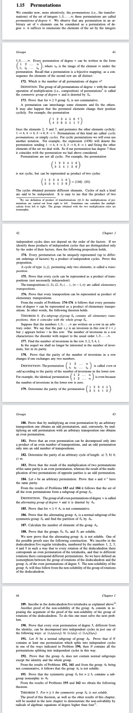

%{(Post "A Dubiously-Simple Proof of the Insolubility of Symmetric Groups"
   "June 2023")}%
*Abel's Theorem in Problems and Solutions* by V.B. Alekseev is a great problem-oriented
textbook that leads the reader to naturally rediscover the titular theorem for himself.
And as all roads to the solvability of equations passes through symmetric groups, even 
Vladimir Arnold—whose lectures the book is based on—is forced to make the pilgrimage.

The important detail about symmetric groups $S_n$ is that they are insoluble
for all $n \geq 5.$ Alekseev spends quite a few pages—about four—proving this fact.
What's interesting is that it all can be skipped by some simple programming.

One approach to proving this theorem is by simple induction. If we show that
$S_5$ is insoluble, and also show that the insolubility of $S_n$ implies the
insolubility of $S_{n+1},$ then we have shown that $S_n$ is insoluble for all
$n \geq 5.$

Look, I'm not gonna go through all the basics of group-theory here, all you 
need to know is that the *commutant* 
$K(G) := \\{aba^{-1}b^{-1}\,:\,\forall a, b\in G\\}$ of a group $G$ is 
a normal subgroup of it. The other thing you need to know is that a group 
is *soluble* if $K(K(\dots K(G)\dots))$ is the trivial group after some finite
number of iterations of $K.$ We denote the $n$th iteration as $K_n(G).$ So
$G$ is solubale if there exists an $r \in \N$ such that $K_r(G)$ is the trivial
group.

Well, actually, one more thing you need to know is that subgroups
of a soluble group are all soluble. So suppose $G$ is soluble and
$H \subseteq G.$ Notice that $K(H) \subseteq K(G),$ and similarly $K_n(H) 
\subseteq K_n(G).$ These facts are easy to verify from the definitions.
As such, if $K_r(G)$ is the trivial group, then $K_r(H)$—being a group—must
also be the trivial group. Therefore $H\subseteq G$ is a soluble group.

Notice that the contrapositive of this statement—that the insolubility 
of $H \subseteq G$ imples the insolubility of $G$—gives us the
inductive step of our proof. We wish to show that the insolubility 
of $S_n$ implies the insolubility of $S_{n+1}.$ If we can show that 
$S_n$ is isomorphic to some subgroup of $S_{n+1},$ then we have shown 
that $S_{n+1}$ is insoluble.

It can easily be shown, for instance, that $S_3$ is isomorphic to a subset of
$S_4.$ Just take a good look at
$$S_3 = \\{123, 132, 213, 231, 312, 321\\}$$
and then look at
$$H = \\{ 1234, 1324, 2134, 2314, 3124, 3214 \\} \subseteq S_4$$
Can you convince yourself and $H\cong S_3?$ If not, consider
this map from $S_3$ to $H$ where $a,b,c$ are digits $\phi(abc) = abc4.$
This idea can easily be generalized to arbitrary $n.$ The symmetric group
$S_n$ is isomorphic to a subset of $S_{n+1}$ via $\phi(i_1i_2\dots i_n) = i_1i_1\dots i_n(n+1).$

All that's left for us to do now is to prove our base case: that $S_5$ is 
insoluble. Contrary to popular belief, base cases are actually much harder
than inductive cases, and this is the exception that proves the rule. Because the
usual proof is quite tedious, while the proof I present here is incredibly easy to do,
though it's not really *math* in the traditional sense. Usually, one would take 
quite a long detour through cyclic permutations and alternating groups and whatnot
to prove that $S_5$ is insoluble. But, remember that $S_5$ is just some finite set 
with a binary operation—something that can be represented as a computational object. 
What I'm trying to say is that brute force is really fun.

So after aquiring your group-theory software of choice (I wrote one for myself
but then threw it away after I realized that [sage](https://www.sagemath.org/)
does group theory), implement a function that gives you the commutant of a group.
This is my solution in sage+python:

```
sage: def K(G):
....:     out = set()
....:     for a in G:
....:         for b in G:
....:             out.add(a*b*a^(-1)*b^(-1))
....:     return out
```

Then just play around a little bit. First I loaded $S_5$ onto the system:

```
sage: S = SymmetricGroup(5)
```

My instinct at this point was to play around with the sizes of this group
and its commutant. The idea was that if the order of the commutants stops
decreasing at some point then that means that the group is insoluble. And,
as it happens, then order of the commutants stops increasing instantly.

```
sage: len(K(S)) == len(K(K(S))
True
```

Well, why stop are the sizes of the commutants? If we can show—sorry, I meant
compute—that $K(S_5) = K(K(S_5)),$ then it's obvious that $K_n(S_5) = K(S_5)$
which means that $S_5$ is not soluble. So I tried it out:

```
sage: K(S) == K(K(S))
True
```

Bam! Just what we wanted. And as we would expect, $K(K(S_4)) \neq K(S_4)$ which
leaves allows $S_4$ to be soluble. In fact we can see how long it takes for $S_4$
to get to the trivial group:

```
sage: S = SymmetricGroup(4)
sage: K(K(K(S)))
{()}
```

That is only $4$ iterations!

Well, there you have it dear readers. That's the show for tonight. If only
Abel had an m1 macbook air. He could've skipped four pages!


