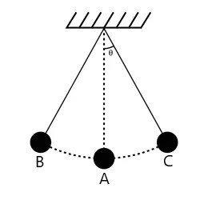

%{(Post "Notes on Landau and Lifshitz: The Equations of Motion" "April 2023")}%

These are my notes for chapter 1 of the mechanics volume of Landau and Lifshitz. 
I hope to be able to explain what I've learned and to alleviate some of the 
confusion I've had with the chapter. I don't recommend reading this if you intend 
to follow the book. The charm of lanlifshitz so far has been its high expectations 
from the reader; it expects you to pull out pencil and paper and try to figure out 
what's being said. My intention is to predigest the material as much as possible to 
reinforce *my own* understanding so the charms of the book are completely lost in
these notes.

---

## Generalized coordinates

The goal of mechanics is to determine the state of a mechanical system at each
point in time. The usual way to represent the state of a physical system is by
using Cartesian coordinates to indicate the position and velocities of each
constituent particle of the system. For instance, we can say that the bulb of
the pendulum follows a circular path with $B = (-1,0), A = (1,1), C = (0,1).$
More generally we can state that the position of the bulb is $q = (\cos\theta(t),
\sin\theta(t))$ with velocity $\dot{q} = (\dot{\theta}(t)\sin\theta(t), -\dot{\theta}(t)\cos\theta(t))$
which would be the state of the system at time $t.$ However all this means is
that this state is uniquely determined by the angle $\theta$ and angular velocity
$\dot{\theta}$! So all we need to do is determine these two variables and the 
rest follows. 

Though in this case we only needed a single parameter $\theta$, we may want
to use a different number of different values in other mechanical systems. So 
suppose that we have $q_1, \dots, q_n$ as our parameters which uniquely determine
the state of the mechanical system. Assuming that we have the same number of 
Cartesian parameters, then we may obtain them with a series of mappings $f_1,\dots ,f_n$
such that $f_i(q_1,\dots,q_n) = (x_i,y_i,z_i) = \vec{r}\_i$ is the $i$th Cartesian parameter.
Consequently:
$$
\vec{v}\_i
= \frac{df_i}{dt} = \sum_{j=1}^n\frac{\partial f_i}{\partial q_j}\dot{q}\_j 
= (\dot{x}\_i, \dot{y}\_i,\dot{z}\_i)
$$
is the Cartesian velocity of the $i$th parameter. If $f_1, \dots, f_n$ are bijective
maps, then we may say that there exists an *isomorphism* between the two coordinate
systems.

This idea of dealing with the necessary parameters up to isomorphism is called
*generalized coordinates*. It seems to be a very profound idea since we can
prove theorems in whichever coordinate system we like and use it to solve
problems that involve other kinds of coordinate systems.

## The principle of least action

Now we know how to represent the state of the system. But how do we determine
it? Lets think like a machine learning junkie for a moment. If we want to
make a model that simulates nature, all we need to find is an error/loss function
that tells us how unrealistic a mechanical system is. However because we have 
to look at the unrealistic behaviour of the system *over time*, we need to look 
at each moment in time and add up the irregularities to get a nice error function.
Let the error at each moment be a function $L$—called the *Lagrangian*—in terms
of $q, \dot{q}$, and time $t.$ So the total error of the system from $t_0$ to
$t_1$ would be:
$$S = \int_{t_0}^{t_1} L(q, \dot{q}, t)\,dt.$$
Normal people call this the *action* of the system from $t_0$ to $t_1$, which is
how I will be referring to it from now on. And to cut all ties with the ML analogy 
I made, we'll be using analytical methods of minimizing this function as opposed 
to gradient descent. We're interested in proving mechanical theorems, not mere 
simulation. I suppose I'll save that for a later post.

## The Euler-Lagrange equation

Assume that $q$ and $\dot{q}$ determine the history with the minimum action. 
So any other history $p$ and $\dot{p}$ would have $S(p, \dot{p}, t) \geq S(q, \dot{q},
t)$; even for $p$ which are only infinitesimally different from $q.$ In such a 
case, $p = q + \delta q$ for some function $\delta q$ which is infinitesimally 
small everywhere except at $t_0$ and $t_1$ where $\delta q(t_0) = \delta q(t_1) =
 0.$ This should be clear from the diagram.

From elementary calculus we know that $S$ is minimized when $S(p, \dot{p}, t) -
S(q, \dot{q}, t) = 0.$ So as we can expand this to see that 
$$
\delta S = S(p, \dot{p}, t) - S(q, \dot{q}, t) = \int_{t_0}^{t_1} \delta L\,dt = 0.
$$
And since 
$\delta L = L(p, \dot{p}, t) - L(q, \dot{q}, t)$,
then 
$\delta L = L(q + \delta q, \dot{q} + \delta \dot{q}, t) - L.$ 
We can get a more complete picture by looking at the Taylor series expansion of 
$L(q + \delta q, \dot{q} + \delta\dot{q}, t)$ with respect to $\delta q.$
$$
L(q + \delta q, \dot{q} + \delta \dot{q}, t) =
L(q,\delta q, t) + \frac{\partial L(p, \dot{p}, t)}{\partial \delta q}\delta q +
\frac{\partial L(p, \dot{p}, t)}{\partial \delta \dot{q}}\delta\dot{q} + \dots
$$
However, since $\delta q$ and $\delta \dot{q}$ are infinitesimal quantities,
we may ignore all the terms in the expansion that are multiples of $\delta q^n$
and $\delta \dot{q}^n$ for $n \geq 2.$ As such:
$$\begin{aligned}
\delta L &= \frac{\partial L(p, \dot{p}, t)}{\partial \delta q}\delta q +
            \frac{\partial L(p, \dot{p}, t)}{\partial \delta \dot{q}}\delta\dot{q} \\\\
&= \frac{\partial L(p, \dot{p}, t)}{\partial p}\frac{dp}{d\delta q}\delta q +
   \frac{\partial L(p, \dot{p}, t)}{\partial \dot{p}}\frac{d\dot{p}}{d\delta \dot{q}}\delta \dot{q}
\end{aligned}$$
Since we have $p = q + \delta q$ and $\dot{p} = \dot{q} + \delta \dot{q}$, then we can 
say that
$$
\begin{aligned}
\partial L(p, \dot{p}, t)/\partial p &= \partial L/\partial q,\\\\
\partial L(p, \dot{p}, t)/\partial \dot{p} &= \partial L/\partial{\dot{q}}, \\\\
\partial (q + \delta q)/\partial \delta q &= \partial (\dot{q} + 
                                             \delta \dot{q})/\partial \delta \dot{q} = 1.
\end{aligned}
$$
And by plugging these in our expression for $\delta L$ we can obtain:
$$
\delta L = \frac{\partial L}{\partial q}\delta q + \frac{\partial L}{\partial \dot{q}}\delta \dot{q} 
$$
We can now use this expression for $\delta L$ to optimize the action. Recall that 
$\delta S = \int_{t_0}^{t_1} \delta Ldt = 0.$ 
We can further expand this by using the expression we derived for $\delta L$,
$$\begin{aligned}
\delta S &= \int_{t_0}^{t_1} \left(\frac{\partial L}{\partial q}\delta q +
            \frac{\partial L}{\partial \dot{q}}\delta\dot{q}\right)\,dt \\\\
&= \int_{t_0}^{t_1} \left(\frac{\partial L}{\partial q}\delta q +
   \frac{\partial L}{\partial \dot{q}}\frac{d\delta q}{dt}\right)\,dt \\\\
&= \int_{t_0}^{t_1} \frac{\partial L}{\partial q}\delta q\,dt +
   \int_{t_0}^{t_1} \frac{\partial L}{\partial \dot{q}}\frac{d\delta q}{dt}\,dt.
\end{aligned}$$
As you can see, the right side of the addition is an integral of a product of derivatives.
So it makes sense to use integration by parts: $\int_a^b uv'dx = 
\left[uv\right]\_a^b - \int_a^b u'vdx.$ In this case $x = t$, $u = \partial L/\partial \dot{q}$,
and $v' = d\delta q/dt.$
$$
\delta S = \int_{t_0}^{t_1} \frac{\partial L}{\partial q}\delta q\,dt + 
           \left[ \frac{\partial L}{\partial\dot{q}}\delta q \right]\_{t_0}^{t_1} -
           \int_{t_0}^{t_1} \frac{d}{dt}\frac{\partial L}{\partial\dot{q}}\delta q\,dt
$$
But since we defined $\delta q$ in such a way as $\delta q(t_0) = \delta q(t_1) = 0$, then 
$\left[ \frac{\partial L}{\partial\dot{q}}\delta q \right]\_{t_0}^{t_1} = 0.$  As such,
$$
\delta S = \int_{t_0}^{t_1} \left(\frac{\partial L}{\partial q} - 
                                  \frac{d}{dt}\frac{\partial L}{\partial\dot{q}}\right)
           \delta q\,dt = 0.
$$
Since we're working in an integral domain, and $\delta q \neq 0$ everywhere but at $t_0$ and $t_1$, 
then we know that
$$
\frac{\partial L}{\partial q} - \frac{d}{dt}\frac{\partial L}{\partial\dot{q}} = 0
\text{\ \ \ \ which implies that\ \ \ \ }
\frac{\partial L}{\partial q} = \frac{d}{dt}\frac{\partial L}{\partial\dot{q}}
$$
on the interval $(t_0, t_1).$ This equation is called the *Euler-Lagrange Equation*.
The function $q$ and $\dot{q}$ that satisfy this differential equation determine
the state of the mechanical system at each point in time.

## Non-uniqueness of the Lagrangian

It's note worthy that the laws of nature do not mandate a unique Lagrangian.
Any two Lagrangians that differ by the time derivative of a function $f(q, t)$
of coordinates and time will describe the same equations of motion under the 
principle of least action. So the mechanical system resulting from
$$L'(q, \dot{q}, t) = L(q, \dot{q}, t) + \frac{d}{dt}f(q, t)$$
is the same as described by $L.$ In percise terms, what this means is that
$\delta S = 0$ implies $\delta S' = 0$ where
$S = \int_{t_0}^{t_1} L\,dt$ and $S' = \int_{t_0}^{t_1}L'\,dt.$
From our definition of $L'$ we can see that
$$\begin{aligned}
S' &= \int_{t_0}^{t_1}L\,dt + \int_{t_0}^{t_1}\frac{d}{dt}f(q, t)\,dt, \\\\
   &= S + f(q(t_1), t_1) - f(q(t_0), t_0).
\end{aligned}$$
Supposing that $\delta S = 0$, then $\delta S' = \delta S + \delta f(q(t_0), t_0) + \delta f(q(t_1), t_1).$
As such, $\delta S' = \delta f(q(t_0), t_0) + \delta f(q(t_1), t_1)$ and each of 
these two terms is clearly zero. As you can see:
$$\begin{aligned}
\delta f(q(t_0), t_0) &= f(q(t_0) + \delta q(t_0), t_0) - f(q(t_0), t_0)\\\\
&= f(q(t_0), t_0) - f(q(t_0), t_0)\\\\
&= 0.
\end{aligned}$$
The same argument holds for $\delta f(q(t_1), t_1)$ since $\delta q(t_1) = 0$ 
as well. Therefore we have shown that Lagrangians that differ by the
derivative of a function of coordinates and time describe the exact
same equations of motion.

## Galilean relativity and Newton's first law

To make our study of mechanical phenomena less of a pain, we'd like to
be able to use the same laws of nature no matter what time or what
place in the universe we happen to be standing on. None of us would like
to come up with different laws of nature for the library at 10 AM and the
soccer field at 2 PM. This principle is one of the fundamental assumptions
of science. Newton very clearly states it in the *Principia:*

> RULE II.
>
> *Therefore to the same natural effects we must, as far as possible, 
> assign the same causes.*

So if a ball falls at a different velocity on Mars than on Earth, we assume
that this variety isn't due to the variety of the laws of nature but to the
variety of the circumstances of measurement. We can state this principle more
percisely: we say that a coordinate system $K$ is *homogeneous* with respect
to a property $P$ if $P(\vec{r}) = P(\vec{r} + \vec{s})$ for all $\vec{r}, 
\vec{s} \in K$; so $P$ does not depend on position. We say that $K$ is *isotropic*
with respect to $P$ if $P(\vec{r}) = P(|\vec{r}|)$ for all $\vec{r} \in K$; so
$P$ does not depend on the direction.

In particular, our assumptions are that

1. **Time is homogenous:** The time axis is homogenous with respect to the 
Lagrangian,
2. **Space is homogenous:** The spatial coordinate system is homogenous
with respect to the Lagrangian,
3. **Space is isotropic:** The spatial coordinate system is isotropic with
respect to the Lagrangian.

Suppose we have a particle moving freely through space. Wanting to study
the motion of this particle, we define a spatial coordinate system $K$ around
this point so that its position $\vec{r}$ and velocity $\vec{v}$ can be 
represeneted as vectors in $K$. Furthermore, we want $K$ to be homogeneous
and isotropic with respect to the Lagrangian; i.e., the laws of nature. The
homogeneity and isotropy of $K$ implies that $\partial L/\partial t =
\partial L/\partial \vec{r} = 0$. Furthermore, since space is isotropic and the
direction of velocity is the same as the direction of the position vector, then
$L$ cannot depend on the direction of velocity in $K$. As such, $L = L(v^2)$. 
So by the Euler-Lagrange equation
$$ \frac{d}{dt}\frac{\partial L}{\partial \vec{v}} = 0. $$
Let $f(\vec{v}) = \partial L/\partial \vec{v}$. We know that $f$ is constant,
and since it's probably an interesting function—i.e., not equal to $\vec{v}/\vec{v}$
or $1$ or something of this sort—then we can safely assume that $\vec{v}$ is
also constant: $\dot{v} = \vec{a} = 0.$

For a free particle, it would make sense for the Lagrangian to be constant.
After all, what kind of information do we have to indicate that the motion
is erroneous? If $L$ is constant, then
$$ \frac{dL}{dt} = \frac{\partial L}{\partial r}v + 
                   \frac{\partial L}{\partial v}a + 
                   \frac{\partial L}{\partial t} = 0. $$
By the homogeneity of time and space, we know that $\partial L/\partial r 
= \partial L/\partial t = 0.$ Therefore
$$ \frac{dL}{dt} = \frac{\partial L}{\partial v}a = 0. $$
Since we deduced in the previous paragraph that $\partial L/\partial v$ is
a constant, then most likely $a = 0$. Note that none of these two explanations
are rigorous proofs, rather they are heuristics to guide our discovery.

Any reference frame $K$ that is homogeneous and isotropic is known as an
*inertial reference frame.* The principle that a free-moving particle
has a constant velocity in an inertial reference frame is known as *Newton's
first law,* or, *the law of inertia.*

To move to and from different inertial frames $K, K'$ with velocities $v, v'$,
we can translate all the coordinates of $K$ to coordinates of $K'$ with the
*Galilean Transformation:* for $r \in K$ and $r' \in K'$: $r' = r + (v' - v)t.$
However, the time in the two frames is assumed to be the same: $t' = t.$ This
is one of the fundamental assumptions of classical mechanics.

## Kinetic energy and the motion of a free particle

So far we have assumed and deduced some properties of the Lagrangian,
but we don't actually know what it looks like. How do we calculate it?
*What's the formula?* So let us begin poking around to see what it
could look like.

So consider a free particle moving with a constant velocity $\vec{v}$ in an inertial
frame $K.$ The frame $K$ itself is moving with an infinitesimal velocity
$\vec{\varepsilon}$ relative to another inertial frame $K'.$ By the Galilean 
transformation, we know that $\vec{v'} = \vec{v} + \vec{\varepsilon}.$ As we discussed,
the Lagrangian of a free particle is in terms of the velocity only; and since the
laws of nature are the same in all inertial frames of reference, then $L(v^2)$ and $L(v'^2)$
must result in the same equations of motion. For this to be the case, they have to differ
only in the time derivative of a function of coordinates and time. Notice that
$L(v'^2) = L((v+\varepsilon)^2) = L(v^2 + \varepsilon^2 + 2\vec{v}\vec{\varepsilon}) = 
L(v^2 + 2\vec{v}\vec{\varepsilon}).$ Expanding the Taylor series of this expression
in terms of $\vec{\varepsilon}$ results in
$$\begin{aligned}
L(v'^2) &= L(v^2) + \frac{\partial L}{\partial v'}\frac{dv'}{d\varepsilon}\vec{\varepsilon} + \dots \\\\
&= L(v^2) + \frac{\partial L}{\partial v^2}2\vec{v}\vec{\varepsilon}.
\end{aligned}$$
We can ignore the $\dots$ because $\varepsilon^n = 0$ for $n > 1.$ As such,
$L(v^2)$ and $L(v'^2)$ differ by $(\partial L/\partial v^2)2\vec{v}\vec{\varepsilon}$ which
is a time derivative of coordinates and time.
$$
\frac{\partial L}{\partial v^2}2\vec{v}\vec{\varepsilon} 
= \frac{d}{dt}f(\vec{r}, t) 
= \frac{\partial f}{\partial \vec{r}}\vec{v}.
$$
After we cancel out $\vec{v}$ from both sides, we can see that the right side does
not have any terms with $\vec{v}$ or $v^2.$ As such, the left side does not have any
either. So $\partial L/\partial v^2 = C$ is some constant. Integrating both sides
we can find that $L = Cv^2$ which we call the *kinetic energy* of the 
particle. In a system of non-interacting particles the total kinetic energy
of the system is the sum of the kinetic energy of each constituent. We say that
$m = 2C$ is the *mass* of the particle. So when we can state the form of kinetic 
energy in familiar terms: $\frac{1}{2}mv^2.$ Why $m$ instead of $C$? Well that's kind
of like the $\pi$ vs $\tau$ debacle: $m$ is older and more established so we change our
formulas to make them work with our intuitions.

One curious fact about the real world is that we don't have negative mass. So if
we wish to find the laws of nature then our laws must not give rise to negative 
mass. In this case we can see this because if we *did* allow for negative mass then
$S = \int_{t_0}^{t_1} \frac{1}{2}mv^2$ would have no lower bound, and as such would
never achieve a minimum; contradicting our assumption about Lagrangians.

In general, we may say that the Lagrangian of $N$ non-interacting particles
is given by:
$$L = \sum_{i=1}^N \frac{1}{2}m_iv_i^2$$
So now we have to consider systems of interacting particles.

## Potential energy and systems of particles.

We have $N$ particles that all interact with each other. Clearly, we can't
keep using the kinetic energy only. Apparently if we subtract from the
Lagrangian of the non-interacting system a function of coordinates 
$U(\vec{r_1}, \dots, \vec{r_N})$ then we're good. The fact that it depends
on position should be clear: if two particles are interacting with each other
we evidently care about their position relative to each other. What I'm not
sure about is why we *only* care about position. Lanlifshitz don't explain this
at all and I haven't found any other source that explains it very well. So I'll
just let it be for now. We call $U(\vec{r_1},\dots,\vec{r_N})$ the *potential
energy* of the system. 

Now that we have deduced the full form of the Lagrangian, the natural next step
is to combine this with the Euler-Lagrange equation and see the fruits of our labor.
In this section we've found—by the additivity of the Lagrangian—that the motion of
a single particle in an interacting system can be deduced from
$$L = \frac{1}{2}mv_i^2 - U(\vec{r}\_1,\dots,\vec{r}\_N).$$
And in the section on the Euler-Lagrange equation, we've found that the
$\vec{r}\_i$ and $\vec{v}\_i$ that describe the true motion of the system
are those that satisfy
$$\frac{\partial L}{\partial \vec{r}\_i} = \frac{d}{dt}\frac{\partial L}{\partial \vec{v}\_i}$$
for all $0\leq i\leq N.$ Substituing our first result into the second we can see that
$$ -\frac{\partial U}{\partial \vec{r}\_i} = m\dot{v}\_i ,$$
which immedietly reminds us of Newton's second law. So to match this with
our existing intuitions we define the *force* on the $i$th particle to be
$\vec{F}\_i = -\partial U/\partial \vec{r}\_i.$ Going in the opposite direction,
if $\vec{F}$ is not defined in terms of $r$, then $U = -\vec{F}\cdot r.$ So when we
wish to determine the potential energy of a particle under constant downwards 
acceleration—such as on Earth—we can do so by finding the dot product of the force
$m(0,-g)$ and position $(x, y)$ which results in $U = mgy$, as we were expecting.
Similarly, we can find the potential energy of a spring by using Hooke's law: $\vec{F} = -k\vec{x}.$
However, since this time force depends on position, we can't use $U = \vec{F}\cdot \vec{x}$, but
must integrate $\vec{F}$ with respect to $\vec{x}$, which results in $U = (kx^2)/2.$

## The Lagrangian in generalized coordinates

Recall that in the section on generalized coordinates, we discussed how
to go to and from different coordinate systems. To go from any set of
coordinates $q_1,\dots,q_N$ to Cartesian coordinates $r_1,\dots,r_N$,
we need a series of bijective maps $f_1, \dots,f_N$ such that
$$\begin{aligned}
r_i &= (x\_i, y\_i,z\_i) = f_i(q_1,\dots,q_N),  \\\\
v_i &= (\dot{x}\_i, \dot{y}\_i,\dot{z}\_i) = \sum_{j=1}^N \frac{\partial f_i}{\partial q_j}\dot{q}\_j.
\end{aligned}.$$
Having found a form of the Lagrangian in the previous section, we now 
know that, in Cartesian terms,
$$L = \frac{1}{2}\sum_{i=1}^N m_iv_i^2 - U(\vec{r}\_1, \dots, \vec{r}\_N).$$
Unfortunately, the potential energy depends too much on the specific physical
problem for us to be able to give a percise statement of it in generalized coordinates.
However, we can find the kinetic energy in generalized coordinates by substituting
our generalized forms for velocities and radius vectors
$$\begin{aligned}
L &= \frac{1}{2}\sum_{i=1}^N m_i\left(\sum_{j=1}^N \frac{\partial f_i}{\partial q_j}\dot{q}\_j\right)^2 -
     U(q_1,\dots,q_N) \\\\
  &= \frac{1}{2}\sum_{i,j,k=1}^N
       \left(
         \frac{\partial f_i}{\partial q_j}\frac{\partial f_i}{\partial q_k}\dot{q}\_j\dot{q}\_km_i
       \right) -
       U(q_1,\dots,q_N) \\\\
  &= \frac{1}{2}\sum_{j,k=1}^N 
       \left[
         \sum_{i=1}^N\left(m_i\frac{\partial f_i}{\partial q_j}\frac{\partial f_i}{\partial q_k}\right)
         \dot{q}\_j\dot{q}\_k
       \right] -
       U(q_1,\dots,q_N).
\end{aligned}$$
To make this match the book's expression, we use $a_{k,j}$ to denote 
$$
a_{j,k}=\sum_{i=1}^N\left(m_i\frac{\partial f_i}{\partial q_j}\frac{\partial f_i}{\partial q_k}\right).
$$
As such the statement of the Lagrangian in generalized coordinates becomes
$$L = \frac{1}{2}\sum_{j,k=1}^N a_{j,k}\dot{q}\_j\dot{q}\_k - U(q_1,\dots,q_N).$$
Which is essentially the same as the one given by Landau and Lifshitz. Apparently
this has something to do with [tensors](https://en.wikipedia.org/wiki/Tensor) but
I have decided to ignore this fact for now since I don't want to learn about tensors.

## Some extra problems

Landau and Lifshitz solve their own problems so I won't go over those here.
These are just some problems I did out of my own curiosity.

**Problem 1.** Find the Lagrangian of the 3D pendulum.

Let a particle of mass $m$ be hung at the end of a pendulum rod that is
$l$ meters long. The position of the particle is given by $(l, \theta, \phi)$
in spherical coordinates. In Cartesian coordinates, it is given by
$$r = (l\sin\theta\cos\phi, l\sin\theta\sin\phi, l\cos\theta).$$
As such the potential energy of the system is $mgl\cos\theta$. To find the
kinetic energy we need to have the square of the velocities as well
$$\begin{aligned}
\dot{x}^2 &= l^2(\dot{\theta}^2\cos^2\theta\cos^2\phi 
                + \dot{\phi}^2\sin^2\theta\sin^2\phi 
                - \frac{\dot{\theta}^2\dot{\phi}^2}{32}\sin^2(2\theta)\sin^2(2\phi)) \\\\
\dot{y}^2 &= l^2(\dot{\theta}^2\cos^2\theta\sin^2\phi 
                + \dot{\phi}^2\sin^2\theta\cos^2\phi 
                + \frac{\dot{\theta}^2\dot{\phi}^2}{32}\sin^2(2\theta)\sin^2(2\phi)) \\\\
\dot{z}^2 &= l^2\dot{\theta}^2\sin^2\theta \\\\
\end{aligned}$$
So by doing some more algebra we can deduce that $\dot{r}^2 = l^2(\dot{\theta}^2 + 
\dot{\phi}^2\sin^2\theta).$ Therefore the Lagrangian is given by 
$$
L = \frac{1}{2}ml^2\left(\dot{\theta}^2 + \dot{\phi}^2\sin^2\theta\right) - mgl\cos\theta
$$
which is what we wanted to find.

**Problem 2.** Find the Lagrangian of a 2D pendulum with a spring.

Let the length of the unstretched spring be $\lambda$ and the length of the
spring, as a function of time, be $l.$ As such, the Cartesian position of
the mass $m$ at the end of the spring is given by $\vec{r} = (l\cos\theta, l\sin\theta).$
The velocity is $\vec{v}$ is given by 
$(\dot{l}\cos\theta - l\dot{\theta}\sin\theta, \dot{l}\sin\theta + l\dot{\theta}\cos{\theta})$
As such the kinetic energy is
$$\begin{aligned}
T &= \frac{1}{2}m[(\dot{l}\cos\theta - l\dot{\theta}\sin\theta)^2 + 
                  (\dot{l}\sin\theta + l\dot{\theta}\cos{\theta})^2] \\\\
  &= \frac{1}{2}m(\dot{l}^2 - 
     (\dot{l}^2 + l^2\dot{\theta}^2)\sin^2\theta - 
     l\dot{l}\dot{\theta}\sin2\theta)
\end{aligned}$$
As for the potential energy, we have the gravitational energy which is
$mgy = mgl\sin\theta.$ Since the spring is $\lambda$ meters long normally,
when it is $l$ meters long is it either being compressed or streteched by
$|l - \lambda|$ meters. Therefore the potential energy of the spring is
$\frac{1}{2}k(l - \lambda)^2$ if the spring's constant is $k.$ So
$U = mgl\sin\theta + \frac{1}{2}k(l - \lambda)^2.$ Since the Lagrangian
is the difference between $T$ and $U$, then
$$L = \frac{1}{2}m(\dot{l}^2 - 
                   (\dot{l}^2 + l^2\dot{\theta}^2\sin^2\theta) - 
                   l\dot{l}\dot{\theta}\sin2\theta) - 
      mgl\sin\theta - \frac{1}{2}k(l - \lambda)^2.$$
Which is what we wanted to find.
