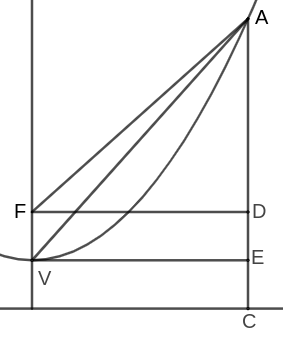

%{(Post "A Proof of Lemma XIV of the First Book of Newton's Principia"
   "September 2022")}%

<b>Lemma XIV</b>

*The prependicular, let fall from the focus of a parabola on its
tangent, is a mean porportional between the distances of the focus from the 
point of contact, and from the principal vertex of the figure.*

%{(align-img "lemma14.png" "right")}%
Newton's original argument is as follows:

>For, let $AP$ be the parabola, $S$ its focus, $A$ its principal vertex, $P$
>the point of contact, $PO$ an ordinate to the principal diameter, $PM$ the 
>tangent meeting the principal diameter in $M$, and $SN$ the perpendicular from
>the focus on the tangent. Join $AN$, and because of the equal lines $MS$ and 
>$SP$, $MN$ and $NP$, $MA$ and $AO$, the right lines $AN$, $OP$ will be 
>parallel; and thence the triangle $SAN$ will be right-angled at $A$, and 
>similar to the equal triangles $SNM$, $SNP$; therefore $PS$ is to $SN$ as $SN$
>is to $SA$.

Though this might seem to be complete, upon further inspection it is clear that
Newton has left quite a lot of work for us to do; as this argument relies on 
the equality of $MS$ and $SP$, $MN$ and $NP$, as well as the equality of $MA$ 
and $AO$. So if we wish to complete Newton's argument, we need to prove these
identities. And so we need to prove the following propositions.

1. *Given that the tangent of a parabola intersects its axis of symmetry 
at $M$, then the distance between $M$ and the focus is equal to the distance 
between the focus and the point of tangency.*

2. *Given that the tangent of a parabola intersects its axis of symmetry 
at $M$, then the perpendicular dropped from the focus onto the tangent is 
equidistant from $M$ and the point of tangency.*

3. *Given that the tangent of a parabola intersects its axis of symmetry at 
$M$, then the distance between $M$ and the vertex is equal to the distance 
between the vertex and the perpendicular dropped from the point of tangency.*

But before we get into this, let me give an introduction to dealing with 
parabolas geometrically for those who might not be familiar with such things.

## Parabolas done geometrically

Most people know parabolas as curves traced by the functions of the form
$f(x) = a[k(x-p)]^2 + q$ where $(p, q)$ is the vertex of the parabola. Though
this representation of a parabola is very useful in a large variety of 
problems—notably those in classical mechanics—it is not a useful tool for our
current problem. The equations get too unwieldy too quickly.  Fortunately, one
may also study parabolas from a geometric/synthetic perspective which is better
suited to this task.

<b>Definition 1</b>

*Given a line $d$ and a point $F$, a parabola is defined as the shape such that
all points on the parabola are equidistant from $d$ and $F$. By convention we
call the $d$* the directrix *and $F$* the focus.

From this definition it is clear that the vertex of the parabola is the midpoint
of the line connecting the focus and the directrix. If it is not clear, then
you can prove it yourself by using the fact that the vertex is the point on the
parabola which is closest to the directrix.

It might not be totally clear how this is related to the algebraic definition.
But I'll convince you that these two definitions have all the same properties
as each other. For instance, we know that a parabola $f$ with its vertex at 
$(0,0)$ is *even*; that is $f(-x) = f(x)$. The analogous property is stated
geometrically as:

<b>Theorem 1</b>

*In any parabola, the line passing through the vertex and the focus is the axis
of symmetry. Meaning that if two points are equidistant from the line passing
through the focus and the vertex, then they are equidistant from the directrix.*

Trace a parabola with focus $F$ and a directrix through $A$ such that $AF$ is
perpendicular to the directrix. Pick any point $X_1$ on the directrix and 
reflect it over $A$ at $X_2$ and connect both to the focus. Notice that, since 
%{(align-img "theorem1.png" "right")}%
$X_1F = X_2F$, then $\angle FX_1A = \angle FX_2A$. And as $\angle Y_1X_1A$ 
and $\angle Y_2X_2A$ are right angles, then $\angle Y_1X_1F$ and 
$\angle Y_2X_2F$ are both equal to $90^\circ - \angle FX_1A$. We now use the
defining property of the parabola by observing that $\triangle X_1Y_1F$ and 
$\triangle X_2Y_2F$ are both isosceles. And since two of their angles and two
of their sides, namely $Y_1X_1F$ and $\angle Y_2X_2F$ and $X_1F$ and $X_2F$
are equal, then $\triangle X_1Y_1F \cong \triangle X_2Y_2F$. Therefore it is
clear that $Y_1X_1 = Y_2X_2$. Q.E.D.

Now you might rightfully protest and say that this isn't enough. "There are many
things other than parabolas which are symmetric", I hear you say. So now we'll
try to convert this shape onto the Cartesian coordinate system to see whether
these two definitions really are equivalent.

<b>Theorem 2</b>

*Let the vertex of the parabola be placed at the origin and let the line $y=-1$ 
be the directrix. The function that traces this parabola is $y = ax\^2$ for 
some $a$.*

Since we determined that the vertex is the midpoint of the line connecting the
focus with the axis of symmetry, then it should be clear that in our present
construction the focus is $F = (0,1)$. Let $P = (x,y)$ be on the parabola. Then
from our definition we know that $y + 1 = PF$ which is equal to
$\sqrt{|x|^2 + |y-1|^2}$. So we obtain the equation
$$
y + 1 = \sqrt{|x|^2 + |y-1|^2}
$$
Which we intend to solve for $y$. So square both sides
$$
y\^2 + 2y + 1 = x\^2 + y\^2 - 2y + 1
$$
And by isolating for $y$ we obtain: $ y = \frac{1}{4}x\^2 $. Q.E.D.

By this point you should truly be convinced of the equality of these two 
defintions. And if not, then feel free to try Newton's lemma by using algebraic
methods. Now I'll provide a sample problem to increase the reader's familiarity
with using these techniques.

<b>Exercise 1</b>

*Suppose that on a parabola with vertex $V$ and a focus $F$ there exists a 
point $A$ such that $AF = 20$ and $AV = 21$. What is the sum of all possible 
values of the length $FV$.* (From the AMC 12)

  

    Show solution
  

  

  After drawing the figure described in the question, draw the directrix of the
  parabola and drop a perpendicular from $A$ onto the directrix at $C$. Let 
  $x = FV$ and notice that
  $$AV\^2 - (AC - x)\^2 = AF\^2 - (AC - 2x)\^2$$
  Now we can solve this equation for $x$. First we substitute the values of 
  $AF$, $AV$, and since $AC = AF$ by the definition of the parabola, we 
  substitute that as well.
  $$
  441 - (20 - x)\^2 = 400 - (20 - 2x)\^2
  $$
  By rearranging we obtain
  $$
  \begin{aligned}
  41 &= (20 - x)\^2 - (20 - 2x)\^2 \\\\
     &= [(20 - x) + (20 - 2x)][(20 - x) - (20 - 2x)] \\\\
     &= x(40 - 3x) \\\\
     &= 40x - 3x\^2
  \end{aligned}
  $$
  And so the solution to our problem is the sum of the two roots of the
  equation $-3x\^2 + 40x - 41$. This is done easily via Vieta's formulas and
  more tediously via simply finding the roots. In the end the answer is 
  $\frac{40}{3}$. Q.E.D.

Now let's show a really cool property of parabolas that we'll end up using later
in our proof. The reflective property of the parabola! This result explains why
parabolic mirrors work the way they do.

<b>Theorem 3</b>

*In a parabola with a tangent at $P$, the angle made by the tangent and the 
parallel line to the axis of symmetry at $P$ is equal to the angle made by the
line drawn from the focus to $P$ and the tangent.*

I tried to prove this via synthetic methods, but I failed so here is an analytic
proof for $y = x\^2$ because I was too lazy to do the general version. Let $P$
be a point on the aforementioned parabola, so $P = (a, a\^2)$ for some $a$. As
%{(align-img "theorem3.png" "left")}%
such, slope of the tangent at $P$ is $2a$. For this parabola, the focus, $F$,
is at point $(0, \frac{1/4})$ and the intersection of the perpendicular from $P$
and the directrix is $(a, -\frac{1}{4})$. Therefore slope of $FD$ is
$$
\frac{\frac{1}{4} - \frac{-1}{4}}{0 - a} = -\frac{1}{2a}
$$
And since the slopes of $AC$ and the tangent at $P$ are negative reciprocals of
each other, then they are perpendicular. And since $FP = PD$ and the tangent
is perpendicular to $FD$, then the tangent bisects $FD$ and as such 
$\angle FPA = \angle DPA$. Which is what we wanted to show. Q.E.D.

## Back to Newton

Previously I'd stated three goals that have to be achieved for this proof to be
complete. Those being:

- [ ] *Given that the tangent of a parabola intersects its axis of symmetry 
at $M$, then the distance between $M$ and the focus is equal to the distance 
between the focus and the point of tangency.*
- [ ] *Given that the tangent of a parabola intersects its axis of symmetry 
at $M$, then the perpendicular dropped from the focus onto the tangent is 
equidistant from $M$ and the point of tangency.*
- [ ] *Given that the tangent of a parabola intersects its axis of symmetry at 
$M$, then the distance between $M$ and the vertex is equal to the distance 
between the vertex and the perpendicular dropped from the point of tangency.*

Now we'll go through these goals step by step and try to achieve them. À la
[means-ends analysis](https://en.wikipedia.org/wiki/Means%E2%80%93ends_analysis)
and [GPS](https://en.wikipedia.org/wiki/General_Problem_Solver).

<b>Goals 1, 2</b>

*Given that the tangent of a parabola intersects its axis of symmetry at 
$M$, then the distance between $M$ and the focus is equal to the distance 
between the focus and the point of tangency and that the perpendicular dropped
from the focus onto the tangent is equidistant from $M$ and the point of 
tangency.*

Let $d$ be the directrix of our parabola $S$ be the focus, and $P$, be the 
point of tangency. As such, $SP = PI$ where $PI$ is perpendicular to the 
directrix. At this point we might as well connect $I$ to the intersection of 
the tangent and the axis of symmetry,
%{(align-img "lemma14-1.png" "left")}%
$M$. Drop a perpendicular from $S$ onto the tangent at $N$ and connect it to
$I$. Notice that by the reflective property, $\angle IPN$ is equal to 
$\angle SPN$. Therefore $\triangle PNI \cong \triangle PNS$ since they share
$PN$. And since we said that $SN$ is perpendicular to the tangent, then both
$\angle INP$ and $\angle SNP$ are equal to $90^\circ$ making $I$, $N$ and $S$
collinear. This also implies that $SN = IN$. We said that $IP$ is perpendicular 
to the directrix, this makes it parallel to $MS$, which also forms right angles 
with the directrix. As such $\triangle MNS \cong \triangle IPN$ which in turn
is congruent to $\triangle PNS$. Therefore, $MN = NP$ and $MS = SP$. Q.E.D.

Well this wasn't too bad. We've already achieved two of our three goals:

- [X] *Given that the tangent of a parabola intersects its axis of symmetry 
at $M$, then the distance between $M$ and the focus is equal to the distance 
between the focus and the point of tangency.*
- [X] *Given that the tangent of a parabola intersects its axis of symmetry 
at $M$, then the perpendicular dropped from the focus onto the tangent is 
equidistant from $M$ and the point of tangency.*

All we need to do now is to achieve the final goal and we'll be done.

<b>Goal 3</b>

*Given that the tangent of a parabola intersects its axis of symmetry at $M$,
then the distance between $M$ and the vertex is equal to the distance between
the vertex and the perpendicular dropped from the point of tangency.*

Drop a perpendicular from $P$ to $O$ and connect the diagonals of $NPOS$. 
Notice that since $\angle PNS$ and $\angle POS$ are both right angles, then
%{(align-img "lemma14-2.png" "right")}% 
$NPOS$ is a cyclic quadrilateral. As such, $\angle SON = \angle NPS$
which is in turn equal to $\angle NSM$.%{(Note "In cyclic quadrilaterals,
the angle between any side and a diagonal is equal to the angle between the
opposite side and diagonal.")}% It should be clear now that $MN = NO$.

By this point the clear next step is to show that $\triangle MNA \cong 
\triangle NOA$. However, this is only possible if the perpendicular from $N$
intersects the axis of symmetry at $A$—the vertex. However, we don't know if 
this is true yet. Well whatever. We'll just assume it for now. As such,
$\triangle MAN \cong \triangle NOA$ and so $MA = AO$. Q.E.D.

Well that's no good. We've technically ticked off goal three, but we've added
another goal in its stead!

- [X] *Given that the tangent of a parabola intersects its axis of symmetry at 
$M$, then the distance between $M$ and the vertex is equal to the distance 
between the vertex and the perpendicular dropped from the point of tangency.*
- [ ] *The perpendicular dropped from $N$ meets the axis of symmetry at the
vertex.*

Well we have nothing better to do so might as well try to finish the last goal.

<b>Goal 4</b>

*The perpendicular dropped from $N$ meets the axis of symmetry at the
vertex.*

Back in goal 1 we showed that $\triangle PIN \cong \triangle PNS \cong 
\triangle MNS$ by using the reflective property of the parabola. This gives us
a hint that $PIMS$ might be rhombus. For that to be true we only need to show 
%{(align-img "lemma14-3.png" "left")}%
that $IM$ is parallel to $PS$. This is easy to show since $\triangle IMN$ is
congruent to $\triangle SMN$ because $IN = NS$ and $MN$ is shared by the two
right triangles. As such $\angle IMN = \angle NPS$ which means that $IM$ is 
parallel to $PS$.

A consequence of this is that—as in all rhombi—the intersection of the
diagonals $N$ is the midpoint of the altitude. So if we drop a two 
perpendiculars from $N$, one to the directrix at $E$ and another to the axis of 
symmetry at $A$, then $IE = NA$. And since we showed in goal 1 that $IN = NS$, 
then $\triangle IEN \cong \triangle NAS$. Meaning that $CA$, which is equal to 
$EN$, is equal to $AS$. As such $A$ is the midpoint of the focus and the 
intersection of the axis and the directrix, making it the vertex of the 
parabola. Q.E.D.

Now we can finally tick off the last goal.

- [X] *The perpendicular dropped from $N$ meets the axis of symmetry at the
vertex.*

And we're done! Having showed all 4 goals, we can now restate Newton's argument
knowing that the proof is complete.

<b>Lemma XIV</b>

*The prependicular, let fall from the focus of a parabola on its
tangent, is a mean porportional between the distances of the focus from the 
point of contact, and from the principal vertex of the figure.*

Since $MS = SP$,
%{(align-img "lemma14.png" "right")}%
$MN = NP$, and $MA = AO$, then $\triangle MNS$ is congruent to $\triangle SNP$.
The triangle $\triangle NAS$, by virtue of sharing $\angle NSA$ with 
$\triangle MNS$ and having a right angle at $\angle NAS$ is similar to 
$\triangle MNS$ and $\triangle SNP$. Therefore $PS$ is to $SN$, as $SN$ is to
$NA$. This completes our proof of lemma XIV of Newton's Principia. Q.E.D.

%{(Footnotes)}%
