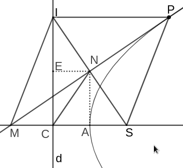

<!--
("A Proof of Lemma XIV of the First Book of Newton's Principia" (july 16 2022) "blog/lemma14.html")
-->

%{(Post "A Proof of Lemma XIV of the First Book of Newton's Principia"
   "September 2022")}%

**Lemma XIV.** The prependicular, let fall from the focus of a parabola on its
tangent, is a mean porportional between the distances of the focus from the 
point of contact, and from the principal vertex of the figure.

Newton's original argument is as follows:

>For, let $AP$ be the parabola, $S$ its focus, $A$ its principal vertex, $P$
>the point of contact, $PO$ an ordinate to the principal diameter, $PM$ the 
>tangent meeting the principal diameter in $M$, and $SN$ the perpendicular from
>the focus on the tangent. Join $AN$, and because of the equal lines $MS$ and 
>$SP$, $MN$ and $NP$, $MA$ and $AO$, the right lines $AN$, $OP$ will be 
>parallel; and thence the triangle $SAN$ will be right-angled at $A$, and 
>similar to the equal triangles $SNM$, $SNP$; therefore $PS$ is to $SN$ as $SN$
>is to $SA$.

Though this might seem perfectly convincing, it still left me with several
questions. Newton's argument relies on the equality of $MS$ and $SP$ as well
as the equality of $MA$ and $AO$. These he does not prove.%{(Note "I'm not sure
if he's relying on some theorems found in Apollonius or other writers on Conics 
here. Since he defers proof of Lemma XIII by stating that: \"This is 
demonstrated by the writers on the conic sections.\"")}% And within my own 
investigation of the problem I have only been able to find proofs of these 
assumptions which utilize the fact that $NA$ is parallel to $PO$, while Newton 
states that as a corrolary of the present lemma. In this post I intend to 
provide a more complete demonstration of this fact and provide sources for the 
theorems whose truth I take for granted.

To begin, let us prove the equality of $MS$ and $SP$. Let $d$ be the directrix
of our parabola $S$ be the focus, and $P$, be the point of tangency. As such,

$SP = PI$ where $PI$ is perpendicular to the directrix. At this point we might
as well connect $I$ to the intersection of the tangent and the axis of symmetry,
$M$. Our resulting picture strongly suggests that $PSMI$ is a rhombus. This can
be verified by noticing that, since $MS$ and $PI$ are parallel, then
$\angle PMS = \angle IPM$, $\angle IMP = \angle MPS$, $\angle MIS = \angle ISP$,
$\angle PIS = \angle ISM$. As such $\angle PIM = \angle PSM$. Therefore, the
triangles $\triangle IPM$ and $\triangle PSM$ are congruent, as the side $MP$
is shared by the two of them. As we have shown that $IP = MS$, then it follows
that $MS = SP$. We may also deduce that $MN = PN$.

By this point things should be a much more clear. Of the three equalities in
Newton's argument, we have already proven two. But we still need to show that
$MA = AO$.

Notice here that $NPOS$ is a 
[cyclic quadrilateral](https://en.wikipedia.org/wiki/Cyclic_quadrilateral).
As such, $\angle NOS$ is equal to $\angle NPS$ which is in turn equal to 
$\angle NMA$.  %{(Note "Cyclic quadrilaterals are quadrilaterals which have two 
right angles which are opposite to each other. They also have the rather nice 
property that the angle made by a side and any diagonal is equal to the angle 
made by the opposite side and the other diagonal.")}% Therefore, 
$\triangle MNO$ is isosceles and as such, $MN = NO$. Since $NA$ is shared by 
the triangles $\triangle MNA$ and $\triangle ONA$, and that $NA$ is 
perpendicular to $MO$, then we may deduce that $\triangle MNA$ is congruent to 
$\triangle ONA$. So it is clear that $MA$ is equal to $AO$.

Now we have shown all three of the equalities presumed by Newton in his proof!
However, we aren't done yet. In showing that $MA = AO$, I assumed that the 

perpendicular from $N$ meets $MO$ at the vertex, $A$;
which I haven't proved yet. So reflect $S$ over $N$ at $S'$. From $N$ drop a 
perpendicular to $d$ at $R$. Therefore, by definition, $S'N = SN$ and
$S'R = R'C$. It should be clear now that $\triangle SS'C$ is similar to 
$\triangle SAN$. Therefore $SA$ is to $AC$ as $SN$ is to $NS'$, meaning that 
$A$ is the midpoint of $SC$. As $S$ is the focus and $C$ the intersection of the
axis of symmetry and the directrix, then $A$ is the vertex of the parabola.

All that remains now is to restate Newton's argument. Since $MS = SP$,

$MN = NP$, and $MA = AO$, then $\triangle MNS$ is congruent to $\triangle SNP$.
The triangle $\triangle NAS$, by virtue of sharing $\angle NSA$ with 
$\triangle MNS$ and having a right angle at $\angle NAS$ is similar to 
$\triangle MNS$ and $\triangle SNP$. Therefore $PS$ is to $SN$, as $SN$ is to
$NA$. This completes our proof of lemma XIV of Newton's Principia. Q.E.D.

%{(Footnotes)}%
